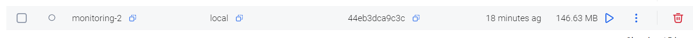

# Етап 1 — Docker-образ для Node.js застосунку (Monitoring-2)

## Мета
Зібрати Docker-образ для Node.js застосунку з папки `Monitoring-2/`, щоб далі запускати його в контейнері та інтегрувати з EFK (Elasticsearch + Fluentd + Kibana).

## Що зроблено
- Створено Dockerfile у `Monitoring-2/`.
- Зібрано Docker-образ локально командою:
  - `docker build -t monitoring-2:local .`

## Dockerfile (поточна версія)
Файл: `Monitoring-2/Dockerfile`

Ключові моменти:
- Використовується базовий образ `node:20-alpine` (легкий образ).
- Залежності встановлюються на окремому шарі через `COPY package*.json` → краще кешування.
- Використано `npm install --omit=dev` (а не `npm ci`), тому що в репозиторії відсутній `package-lock.json`.

## Чому не `npm ci`
`npm ci` працює коректно лише коли присутній lock-файл (зазвичай `package-lock.json`).
Оскільки у папці `Monitoring-2/` lock-файлу немає, під час збірки Docker з `npm ci` виникає помилка.

## Примітка про `NODE_ENV`
Змінну середовища `NODE_ENV=production` вирішено задавати на рівні `docker-compose.yaml` (на етапі запуску), а не «зашивати» в Dockerfile.
Це дає гнучкість: при потребі можна запустити контейнер у dev-режимі без перескладання образу.

## Результат
Після збірки з’являється образ `monitoring-2:local`, який буде використано на наступних етапах для запуску застосунку в Docker та відправки логів у EFK.

## Скріни

### Образ у Docker Desktop

На скріні видно зібраний образ `monitoring-2` з тегом `local`.

