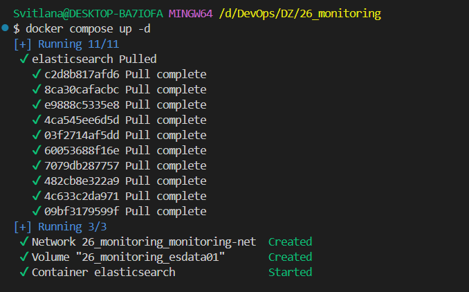
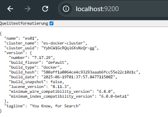
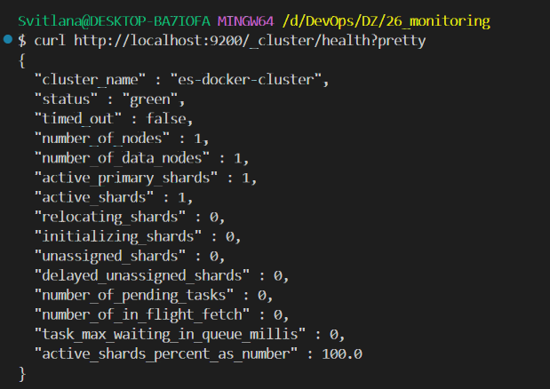

# Етап 2 — Підйом EFK: Elasticsearch (частина 1)

## Мета
Запустити **Elasticsearch** як сховище/пошуковий рушій для логів у стеку **EFK**.

## Навіщо Elasticsearch у EFK
- Приймає події (логи), які Fluentd відправляє в Elasticsearch.
- Зберігає їх у вигляді індексів.
- Дозволяє швидко фільтрувати/шукати по логах (цим користується Kibana).

## Офіційна документація
- https://www.elastic.co/guide/en/elasticsearch/reference/7.17/docker.html

## Налаштування у docker-compose
Файл: `docker-compose.yaml`

```yaml
services:
  elasticsearch:
    image: docker.elastic.co/elasticsearch/elasticsearch:7.17.29
    container_name: elasticsearch
    environment:
      - node.name=es01
      - cluster.name=es-docker-cluster
      - discovery.type=single-node
      - xpack.security.enabled=false
      - bootstrap.memory_lock=true
      - ES_JAVA_OPTS=-Xms512m -Xmx512m
    ports:
      - "9200:9200"
    volumes:
      - esdata01:/usr/share/elasticsearch/data
    networks:
      - monitoring-net

volumes:
  esdata01:

networks:
  monitoring-net:
    driver: bridge
```

### Пояснення ключових параметрів
- `image: ...:7.17.29` — фіксує версію Elasticsearch (важливо для сумісності з Kibana тієї ж версії).
- `container_name: elasticsearch` — зручна назва контейнера (опціонально).
- `discovery.type=single-node` — запускає Elasticsearch в режимі **однієї ноди** (не треба `seed_hosts` і `initial_master_nodes`).
- `xpack.security.enabled=false` — вимикає security/авторизацію для локального навчального стенду (щоб Kibana підключалась без паролів).
- `ES_JAVA_OPTS=-Xms512m -Xmx512m` — обмежує heap JVM (важливо, щоб ES не забирав всю памʼять).
- `ports: "9200:9200"` — відкриває HTTP API Elasticsearch на хості (перевірка через браузер/`curl`).
- `volumes: esdata01:/usr/share/elasticsearch/data` — зберігає дані ES у Docker volume (не зникають після перезапуску).
- `networks: monitoring-net` — спільна мережа для сервісів (Elasticsearch/Kibana/Fluentd бачать один одного по іменам сервісів).

## Перевірка, що Elasticsearch працює
Після старту `docker compose up -d`:
- Відкрити `http://localhost:9200` → має повернутися JSON з інформацією про кластер.

## Скріни

### Запуск Elasticsearch через Docker Compose



### Перевірка Elasticsearch в браузері



### Перевірка стану кластера через `_cluster/health`

Команда для перевірки:
- `curl http://localhost:9200/_cluster/health?pretty`

На цьому скріні видно, що кластер **працює коректно**:
- `status: "green"` — всі primary та replica shards в нормі (для single-node це чудовий результат; інколи буває `yellow`, якщо репліки не можуть розміститись).
- `number_of_nodes: 1` — запущена одна нода (як і потрібно для `discovery.type=single-node`).
- `active_shards_percent_as_number: 100.0` — всі активні шарди підняті.



## Типові проблеми
- **`vm.max_map_count`**: на Windows/WSL2 інколи потрібно підняти системний ліміт для ES. Якщо ES не стартує — дивись `docker logs elasticsearch` і напиши помилку, підкажу команду під твій випадок.
- **`bootstrap.memory_lock=true`**: це не критично для ДЗ; якщо будуть помилки/варнінги з memlock, цю опцію можна прибрати або додати `ulimits`.
