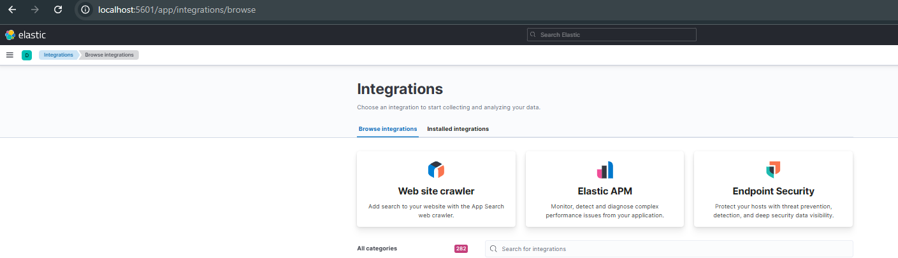
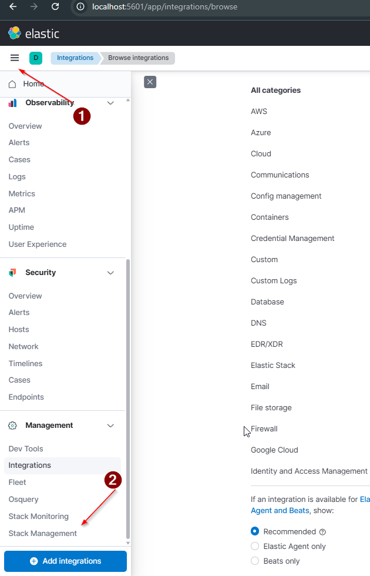
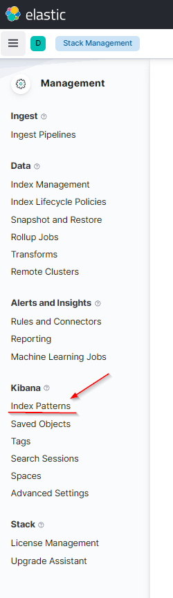
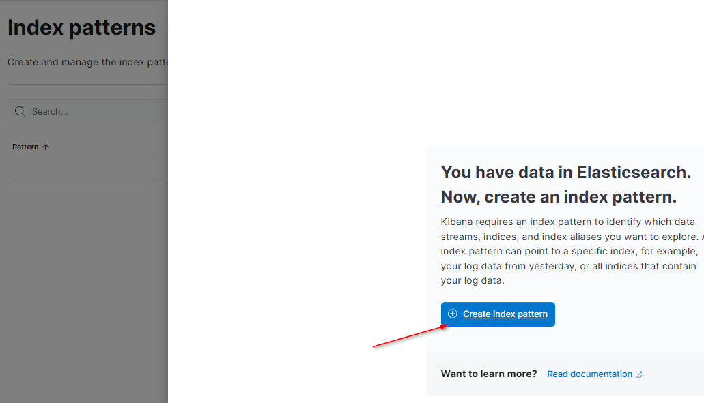
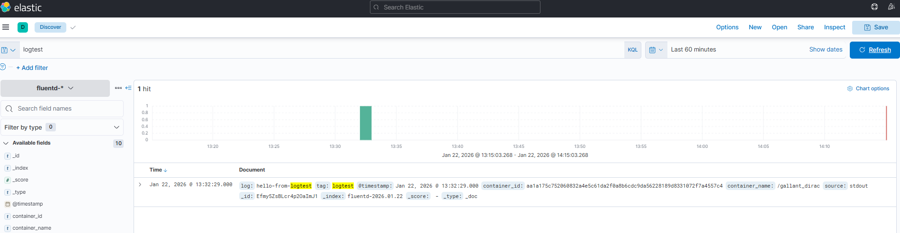
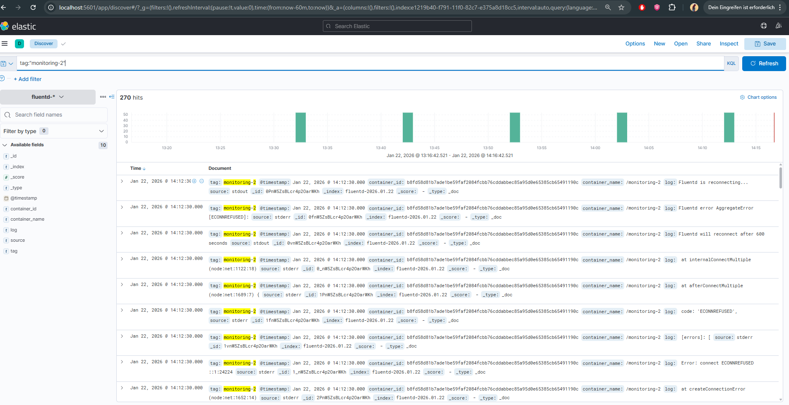
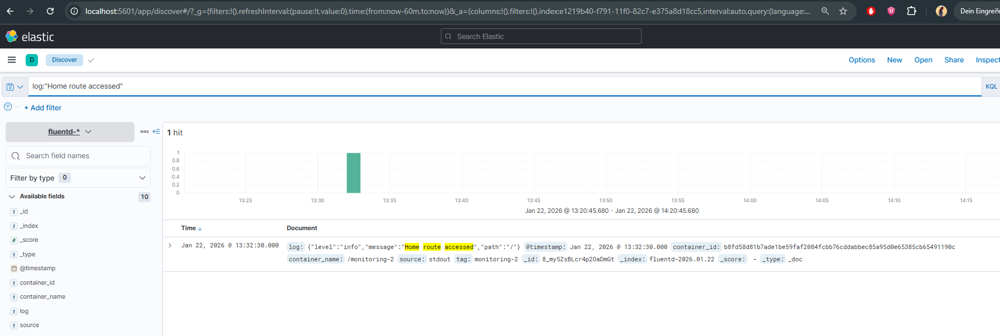

# Етап 2 — Підйом EFK: Kibana (частина 2)

## Мета
Запустити **Kibana** — веб-інтерфейс для перегляду логів, які зберігаються в Elasticsearch.

## Навіщо Kibana у EFK
- Дає UI для пошуку/фільтрації логів (Discover).
- Дозволяє створювати Data View (Index Pattern) для індексів Elasticsearch.
- Може використовуватись для візуалізацій і дашбордів.

## Офіційна документація
- https://www.elastic.co/guide/en/kibana/7.17/docker.html

## Налаштування у docker-compose (без окремого kibana.yml)
Цей варіант використовує змінні середовища (`environment`) і не потребує `volumes`.

Додати в `docker-compose.yaml`:

```yaml
  kibana:
    image: docker.elastic.co/kibana/kibana:7.17.29
    container_name: kibana
    environment:
      - ELASTICSEARCH_HOSTS=http://elasticsearch:9200
    ports:
      - "5601:5601"
    depends_on:
      - elasticsearch
    networks:
      - monitoring-net
```

### Пояснення ключових параметрів
- `image: ...:7.17.29` — версія Kibana має збігатися з версією Elasticsearch.
- `ELASTICSEARCH_HOSTS=http://elasticsearch:9200` — адреса Elasticsearch усередині docker-мережі (по імені сервісу `elasticsearch`).
- `ports: "5601:5601"` — відкриває UI Kibana на хості за адресою `http://localhost:5601`.
  - **Чому 5601?** Це стандартний порт Kibana.
- `depends_on` — запускає Kibana після Elasticsearch (для навчального стенду цього достатньо).
- `networks: monitoring-net` — Kibana і Elasticsearch мають бути в одній мережі.

## Запуск і перевірка
Команди виконуються з кореня проєкту:
- Запуск: `docker compose up -d`
- Перевірка: відкрити `http://localhost:5601`

## Скріни

### Kibana відкривається в браузері

Якщо сторінка Kibana відкрилась за адресою `http://localhost:5601` (навіть якщо це сторінка **Integrations**), це означає:
- контейнер Kibana успішно запущений;
- Kibana доступна з хоста через порт `5601`;
- з’єднання з Elasticsearch налаштоване коректно (інакше зазвичай видно помилку про недоступний Elasticsearch).



## Кроки в Kibana: створення Data View (патерну) для Fluentd
Щоб Kibana могла показувати логи з Elasticsearch, треба створити **Data View** (раніше це називалось Index Pattern).

### Передумови
- Elasticsearch працює та доступний на `http://localhost:9200`.
- Fluentd вже створив індекс `fluentd-*` (див. [docs/04-efk-fluentd.md](04-efk-fluentd.md)).
  - Швидка перевірка: `curl -s "http://localhost:9200/_cat/indices/fluentd-*?v"`

### Крок 1 — Відкрити розділ Data Views
1. У Kibana натиснути меню **☰**.
2. Відкрити **Stack Management**.



3. Перейти в **Kibana → Data Views**.





### Крок 2 — Створити Data View `fluentd-*`
1. Натиснути **Create data view**.
2. У полі **Name** / **Index pattern** ввести: `fluentd-*`.


### Крок 3 — Обрати time field і завершити створення
1. У полі **Timestamp field** обрати `@timestamp`.
2. Натиснути **Create data view**.

Очікувано після цього Kibana покаже поля цього Data View.


## Результат: перегляд логів у Discover
Після створення Data View можна перейти в **Discover** і побачити документи (логи) з індексів `fluentd-*`.

### Крок 1 — Відкрити Discover
1. У Kibana відкрити **☰ → Analytics → Discover**.
2. В лівому верхньому куті вибрати Data View: `fluentd-*`.
3. Справа зверху обрати діапазон часу (наприклад **Last 60 minutes**) і натиснути **Refresh**.


### Крок 2 — Підтвердити “логи приходять” (приклади фільтрів)
У полі пошуку (KQL) можна використовувати фільтри. Ось типові варіанти для цієї ДЗ:
- Тестовий лог: `tag:"logtest"` або `log : "hello-from-logtest"`
- Логи Node.js контейнера: `tag:"monitoring-2"`
- Подія з роуту `/`: `log : "Home route accessed"`

#### Приклад: тестовий лог `hello-from-logtest`


#### Приклад: логи з контейнера `monitoring-2` (tag)


#### Приклад: лог про звернення до `/` (Home route)


## Якщо в Discover порожньо
- Перевір діапазон часу (постав **Last 1 hour**) і натисни **Refresh**.
- Переконайся, що індекс існує: `curl -s "http://localhost:9200/_cat/indices/fluentd-*?v"`.
- Перевір наявність документів через Dev Tools → Console:

```http
GET fluentd-*/_search?size=5&sort=@timestamp:desc
```

## Примітка про `volumes` і `kibana.yml`
У документації Elastic часто показують варіант з монтуванням `kibana.yml` через `volumes`, наприклад:
- `./kibana.yml:/usr/share/kibana/config/kibana.yml`

Це потрібно, коли конфіг хочеться зберігати окремим файлом у репозиторії.
Для цієї ДЗ достатньо варіанту через `environment`.
