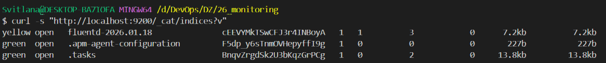
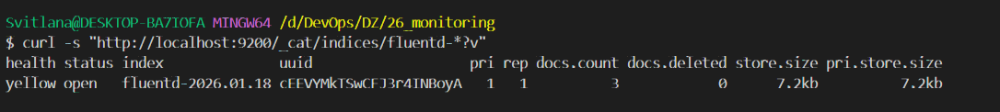

# Етап 2 — Підйом EFK: Fluentd (частина 3)

## Мета
Запустити **Fluentd** як збирач/транспортер логів між застосунком (або Docker logging driver) та Elasticsearch.

## Навіщо Fluentd у EFK
- Приймає логи (наприклад, через протокол **forward** на порту `24224`).
- За потреби може парсити/додавати поля/фільтрувати.
- Відправляє логи в Elasticsearch у форматі, зручному для Kibana.

## Варіант для цієї ДЗ (рекомендований)
Піднімаємо Fluentd окремим контейнером, який:
- слухає `24224` (TCP/UDP) для прийому логів;
- пише в Elasticsearch (порт `9200`).

## Що має бути готово перед стартом
- Піднятий Elasticsearch і доступний на `http://localhost:9200`.
- `docker compose` працює в корені репозиторію.

## Крок 1 — Підготувати Fluentd (Dockerfile + конфіг)
Створити папку `fluentd/` в корені репозиторію і додати в неї два файли:

Важливо:
- файл має називатися саме `Dockerfile` (інакше `docker compose build` не знайде його за замовчуванням);
- для відправки логів у Elasticsearch потрібен плагін `fluent-plugin-elasticsearch`, тому встановлюємо його під час збірки образу.

### fluentd/Dockerfile
```dockerfile
FROM fluent/fluentd:v1.16-debian-1

USER root

# Elasticsearch у нас 7.17.x, тому фіксуємо сумісні версії gem'ів.
# Важливо: базовий образ Fluentd містить Faraday 1.x, тому беремо версію плагіна,
# яка ще сумісна з Faraday 1.x (5.2.5). Починаючи з 5.3.0 плагін вимагає Faraday 2.x.
RUN apt-get update \
  && apt-get install -y --no-install-recommends build-essential \
  && gem install fluent-plugin-elasticsearch -v 5.2.5 --no-document \
  && gem uninstall elasticsearch elasticsearch-api elasticsearch-transport elastic-transport -aIx || true \
  && gem install elasticsearch -v 7.17.0 --no-document \
  && apt-get purge -y --auto-remove build-essential \
  && rm -rf /var/lib/apt/lists/*

COPY fluent.conf /fluentd/etc/fluent.conf

USER fluent
```

Примітка: інколи `build-essential` можна прибрати, але для стабільної збірки (особливо на Windows-хості) краще лишити як у прикладі.

### fluentd/fluent.conf
```conf
<source>
  @type forward
  port 24224
  bind 0.0.0.0
</source>

<match **>
  @type elasticsearch
  host elasticsearch
  port 9200

  # Elasticsearch може стартувати довше, ніж Fluentd. Не валимо Fluentd на старті.
  max_retry_get_es_version 30
  fail_on_detecting_es_version_retry_exceed false
  default_elasticsearch_version 7

  max_retry_putting_template 30
  fail_on_putting_template_retry_exceed false

  logstash_format true
  logstash_prefix fluentd
  include_tag_key true
  tag_key tag
</match>
```

## Крок 2 — Додати Fluentd у docker-compose
У [docker-compose.yaml](../docker-compose.yaml) додай сервіс:

```yaml
  fluentd:
    build:
      context: ./fluentd
    container_name: fluentd
    ports:
      - "24224:24224"
      - "24224:24224/udp"
    depends_on:
      - elasticsearch
    networks:
      - monitoring-net
```

## Крок 3 — Запуск
- Запуск: `docker compose up -d --build`
- Перевірити, що Fluentd піднявся: `docker logs -f fluentd`

Очікувано в логах буде щось на кшталт `listening port=24224`.

## Крок 4 — Перевірка, що індекси зʼявляються в Elasticsearch
Після того як у Fluentd почнуть приходити **будь‑які** події (застосунок або тестовий лог), Elasticsearch створить індекс у форматі `fluentd-YYYY.MM.DD` (бо `logstash_format true`).

Перевірити всі індекси:
- `curl -s "http://localhost:9200/_cat/indices?v"`

Перевірити лише індекси Fluentd:
- `curl -s "http://localhost:9200/_cat/indices/fluentd-*?v"`

Очікуваний результат:
- у списку має зʼявитися індекс на кшталт `fluentd-2026.01.18` (дата відповідає дню, коли прийшли події);
- статус може бути `yellow` — для single-node Elasticsearch це нормально (репліка не може розміститись, бо немає другого вузла).

Опційно (не обовʼязково для ДЗ): щоб зробити індекс `green` на одному вузлі, можна виставити `number_of_replicas: 0` для індексу.

## Докази (скріншоти)
Фактичні скріншоти (з папки `screens/` у корені репозиторію):





## Типові помилки та рішення
Якщо індексів `fluentd-*` немає і вивід порожній або є лише службові індекси (`.kibana*`, `.geoip_databases`, тощо) — це означає, що події ще не надсилались у Fluentd.

Якщо бачиш в логах Fluentd:
- `Connection refused ... :9200` — Fluentd стартував раніше, ніж Elasticsearch встиг підняти HTTP порт. Це нормально; після старту ES Fluentd має підхопитись.
- `undefined method [] for nil:NilClass` під час `send_bulk` — зазвичай це ознака несумісних версій Ruby gem'ів клієнта Elasticsearch з версією Elasticsearch. У цьому ДЗ фіксуємо сумісні версії (див. Dockerfile вище).
- `Gem::ConflictError ... faraday-1.x conflicts with faraday (>= 2.0.0)` — означає, що встановлена версія `fluent-plugin-elasticsearch` вимагає Faraday 2.x, але в базовому образі є Faraday 1.x. Рішення: взяти `fluent-plugin-elasticsearch` 5.2.5 (вона залежить від Faraday ~> 1.10).

## Далі
Якщо Fluentd запущений і індекс `fluentd-*` зʼявляється, на наступному етапі можна підключити Node.js контейнер через Docker logging driver `fluentd` (тобто без зміни коду застосунку) і дивитися логи в Kibana.

## Посилання
- Fluentd docs: https://docs.fluentd.org/
- Fluentd Docker image: https://hub.docker.com/r/fluent/fluentd
- Input plugin `forward`: https://docs.fluentd.org/input/forward
- Elasticsearch output plugin: https://github.com/uken/fluent-plugin-elasticsearch
